```mermaid
classDiagram
    %% =================================================================================
    %% 1. MÓDULO DE IDENTIDAD Y USUARIOS (AUTH MODULE)
    %% Responsable de: Autenticación, Roles, Perfiles Base
    %% =================================================================================
    namespace 01_Identity_Auth_Module {
        %% --- ENTITIES ---
        class User {
            +Int id
            +String email
            +String passwordHash
            +String fullName
            +String? avatarUrl
            +UserRole role
            +Boolean isActive
            +DateTime createdAt
        }

        class PatientProfile {
            +Int id
            +Int userId
            +String phone
            +String bloodType
            +DateTime dob
        }

        %% --- DTOs (Data Transfer Objects) ---
        class RegisterDto {
            +String email
            +String password
            +String fullName
        }
        
        class LoginDto {
            +String email
            +String password
        }

        class UpdateUserDto {
            +String? fullName
            +String? phone
            +String? avatarUrl
        }

        class AuthResponseDto {
            +String accessToken
            +User user
        }

        %% --- LOGIC LAYERS ---
        class AuthController {
            +register(RegisterDto) User
            +login(LoginDto) AuthResponseDto
        }

        class UsersController {
            +getProfile(Request) User
            +updateProfile(UpdateUserDto) User
            +uploadAvatar(File) String
        }

        class AuthService {
            +validateUser(email, pass) User
            +login(user) AuthResponseDto
            +hashPassword(pass) String
        }

        class UsersService {
            +findOne(id) User
            +update(id, data) User
        }
    }

    %% =================================================================================
    %% 2. MÓDULO MÉDICO (DOCTORS MODULE)
    %% Responsable de: Gestión de Doctores, Especialidades y Configuración de Horarios
    %% =================================================================================
    namespace 02_Medical_Management_Module {
        %% --- ENTITIES ---
        class DoctorProfile {
            +Int id
            +Int userId
            +String specialty
            +String licenseNumber
            +String bio
            +Int consultationFee
        }

        class Availability {
            +Int id
            +Int doctorId
            +Int dayOfWeek
            +String startTime
            +String endTime
            +Int slotDurationMinutes
            +Boolean isActive
        }

        %% --- DTOs ---
        class PromoteToDoctorDto {
            +String specialty
            +String licenseNumber
            +String bio
            +Int fee
        }

        class SetAvailabilityDto {
            +Int dayOfWeek
            +String startTime
            +String endTime
            +Int duration
        }

        class FilterDoctorDto {
            +String? specialty
            +String? name
        }

        %% --- LOGIC LAYERS ---
        class DoctorsController {
            +listDoctors(FilterDoctorDto) DoctorProfile[]
            +promoteUser(userId, PromoteToDoctorDto) DoctorProfile
            +setAvailability(SetAvailabilityDto[]) void
        }

        class DoctorsService {
            +findAll(filters) DoctorProfile[]
            +createProfile(userId, data) DoctorProfile
            +updateAvailability(doctorId, rules) void
            +getWorkingHours(doctorId) Availability[]
            +checkSlotFree(doctorId, start, end) Boolean
        }
    }

    %% =================================================================================
    %% 3. MÓDULO DE OPERACIONES (APPOINTMENTS MODULE)
    %% Responsable de: Flujo de Citas, Reservas, Cancelaciones e Historial
    %% =================================================================================
    namespace 03_Operations_Appointments_Module {
        %% --- ENTITIES ---
        class Appointment {
            +Int id
            +DateTime startTime
            +DateTime endTime
            +AppointmentStatus status
            +String? cancelReason
            +Int doctorId
            +Int patientId
        }

        class MedicalRecord {
            +Int id
            +Int appointmentId
            +String diagnosis
            +String prescription
            +String privateNotes
            +DateTime createdAt
        }

        %% --- DTOs ---
        class CreateAppointmentDto {
            +Int doctorId
            +String startTimeISO
            +String reason
        }

        class CancelAppointmentDto {
            +String reason
        }

        class CompleteAppointmentDto {
            +String diagnosis
            +String prescription
            +String notes
        }

        %% --- LOGIC LAYERS ---
        class AppointmentsController {
            +create(CreateAppointmentDto) Appointment
            +cancel(id, CancelAppointmentDto) Appointment
            +complete(id, CompleteAppointmentDto) MedicalRecord
            +getMyAppointments() Appointment[]
        }

        class AppointmentsService {
            -NotificationService notifier
            +create(patientId, dto) Appointment
            +cancel(id, userId, reason) Appointment
            +complete(doctorId, apptId, data) MedicalRecord
            -validateConflict(doctorId, start, end) Boolean
        }
    }

    %% =================================================================================
    %% RELACIONES E INTERACCIONES DEL SISTEMA
    %% =================================================================================

    %% 1. Relaciones de Base de Datos (Entities)
    User "1" *-- "0..1" PatientProfile : posee
    User "1" *-- "0..1" DoctorProfile : posee
    DoctorProfile "1" *-- "*" Availability : define
    
    DoctorProfile "1" -- "*" Appointment : atiende
    PatientProfile "1" -- "*" Appointment : solicita
    Appointment "1" -- "0..1" MedicalRecord : genera resultado

    %% 2. Flujo de Control (Controller -> Service)
    AuthController ..> AuthService : usa
    UsersController ..> UsersService : usa
    DoctorsController ..> DoctorsService : usa
    AppointmentsController ..> AppointmentsService : usa

    %% 3. Dependencias entre Módulos (Cross-Module Communication)
    AuthService ..> UsersService : busca user
    DoctorsController ..> UsersService : promueve user
    AppointmentsService ..> DoctorsService : valida disponibilidad
```

# 🏥 MediNext - Sistema de Gestión de Turnos Clínicos

> **[🔗 Ver Demo de la Aplicación](LINK_A_TU_DEPLOY)** | **[📄 Documentación API (Swagger)](LINK_A_TU_SWAGGER)**

## 📋 Descripción del Proyecto

**MediNext** es una solución Full Stack diseñada para optimizar la gestión operativa de una clínica médica. El sistema digitaliza el flujo completo de atención: desde el registro de pacientes y la administración de roles profesionales, hasta la gestión dinámica de agendas y reservas de turnos en tiempo real.

El proyecto simula un entorno de producción real, haciendo énfasis en una arquitectura escalable, testing automatizado y reglas de negocio complejas para evitar conflictos de horarios y asegurar la integridad de los datos.

---

## 🚀 Funcionalidades Principales

El sistema orquesta la interacción entre tres actores clave:

### 1. Administración (La Clínica)
* **Gestión de Jerarquía:** Capacidad exclusiva para gestionar el staff médico. El administrador puede otorgar o revocar el rol de "Doctor" a usuarios registrados, habilitando funcionalidades avanzadas en sus perfiles.
* **Control de Usuarios:** Administración centralizada de la base de datos de pacientes y accesos.

### 2. Módulo Médico (Doctores)
* **Gestión de Disponibilidad:** El médico define sus propias franjas horarias y días laborales. El sistema calcula dinámicamente los "slots" disponibles basándose en la duración de la consulta configurada.
* **Dashboard Profesional:** Visualización de agenda diaria y semanal, permitiendo ver el detalle de los pacientes asignados y sus horarios.
* **Perfil Profesional:** Configuración de especialidad médica para indexación en el buscador público.

### 3. Portal del Paciente
* **Reserva Inteligente:** Búsqueda de especialistas y gestión de reservas. El sistema valida en tiempo real la disponibilidad para prevenir *overbooking* (sobreventa de turnos).
* **Mis Turnos:** Dashboard personal con el estado de las citas en tiempo real.
* **Notificaciones:** Sistema automático de envío de correos electrónicos tras la confirmación de una cita.

---

## 🏗 Arquitectura y Calidad de Software

El backend ha sido construido para asegurar su mantenibilidad y testabilidad.

### Arquitectura por Capas (Layered Architecture)
Siguiendo los patrones de diseño de NestJS, la aplicación separa responsabilidades claramente:
1.  **Controllers (Capa de Presentación):** Manejan las peticiones HTTP, validan los DTOs (Data Transfer Objects) y gestionan la respuesta al cliente.
2.  **Services (Capa de Lógica de Negocio):** Contienen toda la inteligencia del sistema (validación de fechas, lógica de turnos, gestión de roles). Aquí reside el valor del producto.
3.  **Data Access (Repositorios/Prisma):** Capa encargada exclusivamente de la comunicación con la base de datos PostgreSQL.

### Testing y Confiabilidad 🧪
Para garantizar la estabilidad del sistema, se ha integrado **Jest** como framework de pruebas.
* **Unit Testing:** Cobertura de pruebas unitarias para Servicios y Controladores, asegurando que la lógica de negocio funcione aislada de dependencias externas.
* **Tipado Estricto:** Uso extensivo de TypeScript para reducir errores en tiempo de ejecución.

---

## 🛠 Stack Tecnológico

### Backend (API REST)
* **Framework:** **NestJS**. Modularidad e Inyección de Dependencias.
* **Base de Datos:** **PostgreSQL**.
* **ORM:** **Prisma**. Modelado de datos declarativo y migraciones seguras.
* **Documentación:** **Swagger (OpenAPI)**. Autogeneración de docs para facilitar el consumo de la API.
* **Testing:** **Jest**.
* **Email:** Integración SMTP para notificaciones transaccionales.
* **Seguridad:** Integración de JWT para la autenticacion de usuarios y peticiones.

### Frontend (SPA)
* **Framework:** **Angular**. Componentes reactivos, Servicios y Guards para seguridad.
* **Estilos:** **Tailwind CSS**. Diseño *Mobile-First* y UI moderna.
* **UX:** Feedback visual inmediato (Toasts, Spinners).

---

## 🧩 Modelo de Datos (Highlights)

El diseño de la base de datos resuelve retos interesantes de modelado:

1.  **Herencia de Roles Dinámica:** La entidad `Doctor` es una extensión opcional de `Usuario`. Esto permite que un usuario pueda "convertirse" en doctor sin duplicar datos de autenticación, manteniendo la BD normalizada.
2.  **Validación:** Al reservar un turno, el sistema ejecuta una transacción atómica que verifica la existencia del médico, la disponibilidad horaria y la ausencia de conflictos antes de confirmar la escritura en la base de datos.

---

---

## 👨‍💻 Autor

Desarrollado por **Marcos Aguirre**.

* Portfolio: https://portfoliomarcosdaag.vercel.app/
* LinkedIn: https://www.linkedin.com/in/marcosaguirre9/
* Email: marcosoffs99@gmail.com

